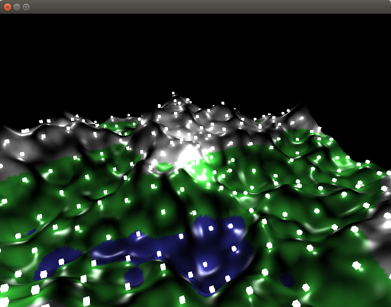

<!--
    Copyright 2017 The Gfx-rs Developers.

    Licensed under the Apache License, Version 2.0 (the "License");
    you may not use this file except in compliance with the License.
    You may obtain a copy of the License at

        http://www.apache.org/licenses/LICENSE-2.0

    Unless required by applicable law or agreed to in writing, software
    distributed under the License is distributed on an "AS IS" BASIS,
    WITHOUT WARRANTIES OR CONDITIONS OF ANY KIND, either express or implied.
    See the License for the specific language governing permissions and
    limitations under the License.
-->

# Deferred Shading Example

This is an example of deferred shading with gfx-rs. It demonstrates the use of render targets and uniform buffers. It requires GL-3.2 to run.

Two render targets are created: a geometry buffer and a result buffer.

Rendering happens in two passes:
First,  the terrain is rendered, writing position, normal and color to the geometry buffer.
Second, the lights are rendered as cubes. each fragment reads from the geometry buffer,
        light is applied, and the result is written to the result buffer.

The result buffer is then displayed.

Press 1-4 to show the immediate buffers. Press 0 to show the final result.

## Screenshot

## Useful libraries

- [glfw-rs](https://github.com/bjz/glfw-rs)
- [cgmath-rs](https://github.com/bjz/cgmath-rs)
- [noise-rs](https://github.com/bjz/noise-rs)

